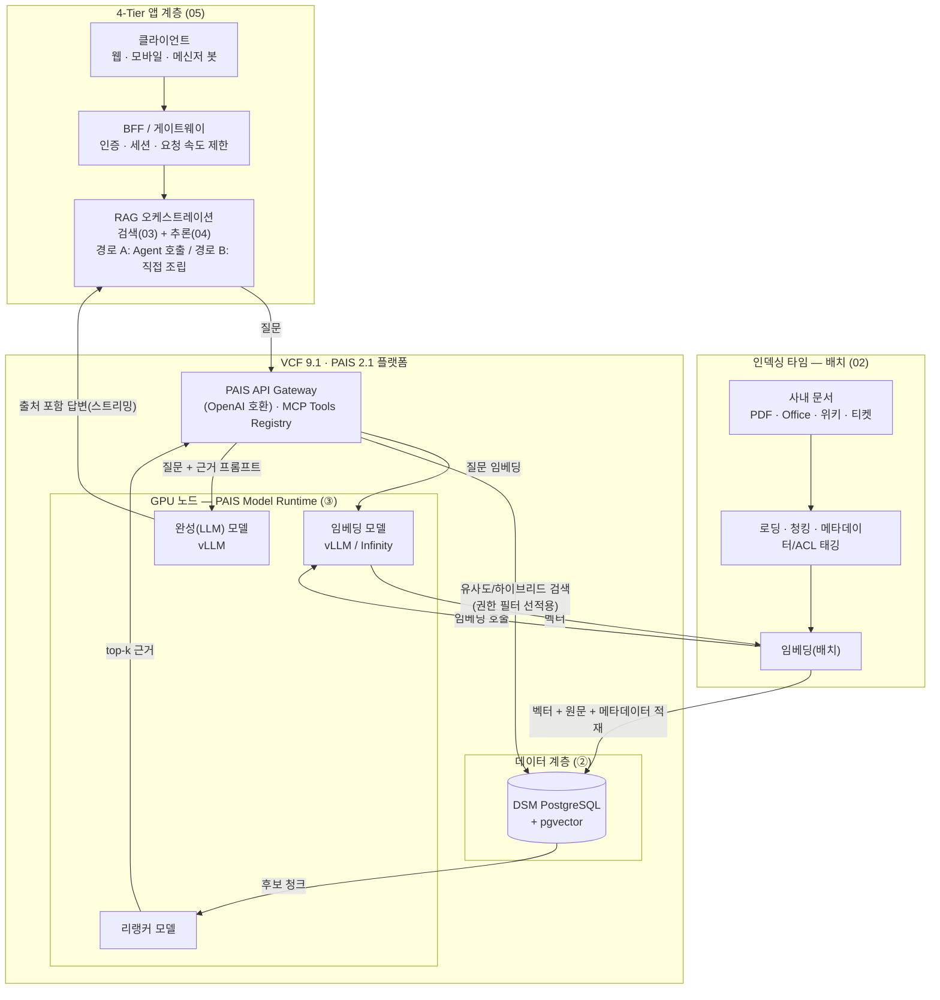

# 01 — 레퍼런스 아키텍처 전경

[← 목차로](../README.md)

## 1.1 RAG가 푸는 문제

LLM은 학습 시점까지의 일반 지식만 압니다. **사내 정책·계약·기술 문서**는 모릅니다. 파인튜닝으로 주입할 수도 있으나 비용·갱신 주기 문제가 큽니다. RAG(Retrieval-Augmented Generation)는 다른 접근입니다 — 질문이 들어오면 **사내 문서에서 관련 조각을 검색해 프롬프트에 끼워 넣고**, 모델이 그 근거를 바탕으로 답하게 합니다. 모델은 그대로 두고, 지식은 외부(벡터 DB)에 둡니다.

장점은 셋입니다. ① 문서를 갱신하면 즉시 반영된다(재학습 불필요). ② 답변에 **출처**를 붙일 수 있다. ③ 데이터가 모델 가중치에 박히지 않아 접근 통제가 쉽다.

여기서 RAG가 막으려는 문제를 분명히 해 둡니다. **환각(hallucination)** 은 모델이 모르는 것을 그럴듯하게 지어내는 현상입니다 — LLM은 사실을 '아는' 게 아니라 학습 데이터의 통계적 패턴으로 다음 토큰을 고르므로, 근거가 없으면 빈칸을 자신 있게 메웁니다. **그라운딩(grounding)** 은 답을 **외부 근거 문서에 묶어** 이 지어내기를 억제하는 것이고, RAG가 바로 그 장치입니다 — 검색한 근거를 프롬프트에 넣어 "이 안에서만 답하라"로 모델을 구속합니다. 그래서 RAG의 핵심 품질 지표가 **근거 충실도(faithfulness)** — 답이 검색된 근거에서만 나왔는가 — 이며, 근거 충실도가 높을수록 환각이 줄어듭니다(측정은 [문서 06](06-evaluation-quality.md)).

## 1.2 전체 데이터 흐름

RAG는 두 개의 시간대로 나뉩니다.

**(A) 인덱싱 타임 — 미리, 배치로**

```
사내 문서 → 로딩 → 청킹 → 임베딩(embedding model) → pgvector 적재
```

문서를 작은 조각(chunk)으로 쪼개고, 각 조각을 임베딩 모델로 벡터화해 pgvector에 저장합니다. 한 번 해두면 질의마다 반복하지 않습니다. (상세: [02](02-ingestion-indexing.md))

**(B) 쿼리 타임 — 사용자 질문이 올 때마다**

```
질문 → 질문 임베딩 → pgvector 유사도 검색 → (리랭킹) → 컨텍스트 조립
     → LLM 프롬프트(질문 + 근거) → 추론 → 출처 포함 답변
```

질문도 같은 임베딩 모델로 벡터화해 가장 가까운 조각들을 찾고, 그 조각들을 프롬프트에 넣어 모델에 보냅니다. (상세: [03](03-retrieval-context.md), [04](04-inference-integration.md))

**(C) 전체 도식 — 2-타임라인 × 4-Tier × 컴포넌트 매핑**

위 두 흐름을 한 그림으로 합치면 다음과 같습니다. 왼쪽은 인덱싱 타임(배치), 오른쪽은 쿼리 타임(요청마다)이며, 4-Tier 앱 계층(05)과 PAIS·pgvector(②)·GPU 노드(③)가 어디서 맞물리는지를 표시합니다. (GitHub에서 자동 렌더링됩니다.)



> 인덱싱 타임은 미리 한 번(또는 증분으로) 돌고, 쿼리 타임은 사용자 요청마다 GPU 노드의 임베딩·리랭킹·완성 모델과 pgvector를 오가며 동작합니다. 경로 A(Agent Builder)를 쓰면 점선 안쪽의 검색→리랭크→생성 오케스트레이션을 플랫폼이 대신 수행하고, 경로 B를 쓰면 오케스트레이션 계층이 같은 흐름을 직접 호출합니다(1.4).

## 1.3 VCF 컴포넌트 매핑

| RAG 단계 | VCF / PAIS 컴포넌트 | 시리즈 참조 |
|----------|---------------------|-------------|
| 임베딩 모델 서빙 | PAIS Model Runtime (vLLM / Infinity) | ③ |
| 벡터 저장·검색 | DSM PostgreSQL + pgvector | ② |
| 완성(LLM) 모델 서빙 | PAIS Model Runtime (vLLM) | ③ |
| 검색·오케스트레이션 | PAIS **Agent Builder** + Data Indexing, 또는 앱 직접 구현 | ③④ |
| 외부 도구 연동 | PAIS **MCP Tools Registry** | ① 05 |
| API 노출·인증 | PAIS API Gateway (OpenAI 호환) | ③ |

> PAIS는 Model Gallery·Model Runtime·**Agent Builder**·**Data Indexing(RAG)**·API Gateway·MCP Tools Registry를 포함합니다. RAG에 필요한 조각이 플랫폼 안에 이미 있습니다.

## 1.4 빌드 vs 바이 — 두 가지 조립 방식

VCF에서 RAG를 만드는 길은 둘입니다. 이 선택이 04–05의 구현을 가릅니다.

**경로 A — PAIS Agent Builder (노코드/로우코드, 권장 출발점)**

PAIS의 Agent Builder는 RAG 앱을 위한 관리형 빌더입니다. 사용자는 사용 가능한 **모델**과 등록된 **Knowledge Base**를 확인하고, Agent가 완성 모델·Knowledge Base·인덱스 사이의 상호작용을 오케스트레이션합니다. 청킹·임베딩·검색·프롬프트 조립의 상당 부분을 플랫폼이 처리합니다.

- 적합: 표준적인 문서 Q&A, 빠른 개념검증(PoC), 운영 부담 최소화
- 트레이드오프: 청킹/검색 전략의 세밀한 제어는 제한될 수 있음

**경로 B — 앱이 직접 오케스트레이션 (풀 컨트롤)**

앱이 임베딩 API·pgvector·완성 API를 직접 호출하며 파이프라인을 손수 조립합니다. PAIS의 **OpenAI 호환 API**(임베딩·완성)와 ②의 pgvector를 그대로 씁니다.

- 적합: 커스텀 청킹·하이브리드 검색·리랭킹·복잡한 후처리가 필요한 경우
- 트레이드오프: 직접 구현·운영 부담

> **권장**: 경로 A로 시작해 검색 품질의 한계가 보이면, 병목 단계만 경로 B로 내려 커스터마이즈하는 하이브리드. 본 가이드는 두 경로를 모두 다루되, 02–03은 경로 B의 내부 동작을 설명해 경로 A를 쓸 때도 무엇이 일어나는지 이해하게 합니다.

## 1.5 이 가이드를 읽는 법

02–03은 인덱싱·검색의 **원리와 의사결정**(경로 무관 공통 지식), 04–05는 **PAIS API/Agent로의 실제 연결**, 06–07은 **품질과 운영**입니다. 각 문서 끝의 "핵심 결정" 표만 모아 읽어도 설계 체크리스트가 됩니다.

---
[목차](../README.md) · [다음: 02 데이터 인입·인덱싱 →](02-ingestion-indexing.md)
