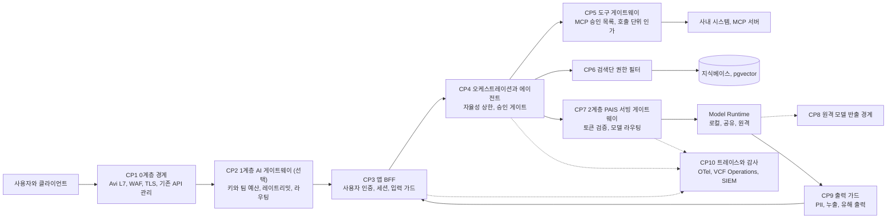

# 00 — 어디서부터 시작하나: 보안 청사진과 첫 90일

> 기반 버전은 [README 버전 기준 문서](../README.md#기반-버전-source-of-truth)를 참조하세요.
> 시리즈 인덱스: [시리즈 허브](../../README.md)

이 문서는 시리즈 ⑤의 착수 문서입니다. 01~08이 "무엇을 왜 어떻게 통제하는가"의 카탈로그라면, 이 문서는 그 카탈로그를 앞에 두고 자주 받는 세 질문에 답합니다. 보안 때문에 전체를 어떻게 그려야 하는가, 무엇부터 손대야 하는가, 첫 유스케이스를 올리기까지 무엇을 갖춰야 하는가. 통제 항목이 시리즈 전체에 70개를 넘다 보니 한꺼번에 들이려다 멈추는 조직이 많아서, 한 장 청사진, 90일 로드맵, 게이트별 최소 세트, 준비물, 흔한 실수로 좁혔습니다.

이 문서의 시점은 플랫폼 전체를 책임지는 보안팀과 플랫폼 팀입니다. 서비스 하나를 출시하는 앱 팀이 준비할 것은 [앱 가이드 12 서비스 보안 준비와 가드레일](https://github.com/JaeHoYun/vcf-private-ai-apps/blob/main/docs/12-service-security.md)이 맡고, 전사 운영 모델과 규제 일정은 [AX 방법론 10 AI 거버넌스](https://github.com/JaeHoYun/enterprise-ax-methodology/blob/main/docs/10-governance.md)와 [부록 A2](https://github.com/JaeHoYun/enterprise-ax-methodology/blob/main/appendix/A2-kr-regulatory-timeline.md)가 맡습니다. 기반 사실은 VCF 9.1.1 / PAIF 9.1.1 / PAIS 3.0(2026-09-03 GA)이며, 발표만 된 기능은 설계 전제로 삼지 않습니다([① 00 0.7.4절](../../01-infra/docs/00-whats-new.md)).

---

## 0.1 먼저 정할 것 세 가지

착수 전에 다음 세 가지를 합의하면 뒤의 결정이 빨라집니다.

1. **통제의 주소는 요청 경로다.** [01 1.3절](01-threat-model.md)의 다층 방어 계층(L1 하이퍼바이저부터 L6 운영까지)은 책임을 나누는 축이고, 실제 요청은 사용자에서 모델까지 한 경로를 지나갑니다. 청사진은 그 경로 위에 통제 지점을 찍는 방식으로 그립니다(0.2절). 계층별 통제 목록만 있으면 "이 요청이 어디서 검사되는가"에 답하지 못합니다.
2. **플랫폼이 주는 것과 앱이 만들어야 하는 것을 가른다.** PAIS 3.0은 인증(OIDC와 API 토큰), 네임스페이스 격리, 외부 MCP 도구의 승인 게이트, 에이전트 상호작용 추적을 제공합니다. 콘텐츠 가드레일(입출력 필터), 최종 사용자 신원의 도구와 검색까지의 전파, 호출 단위 사람 승인, 지식베이스 안 문서 단위 권한 필터는 제공한다는 공식 근거가 없으므로 앱과 게이트웨이 계층이 만듭니다([06 6.5절](06-app-guardrails.md), [앱 가이드 00 0.3절](https://github.com/JaeHoYun/vcf-private-ai-apps/blob/main/docs/00-orientation.md)). 이 경계를 착수 시점에 문서로 못 박지 않으면 "플랫폼에 있는 줄 알았다"는 공백이 출시 직전에 드러납니다.
3. **첫 유스케이스는 읽기 전용, 자율성 L1 이하로 시작한다.** 미국 CISA와 호주 등 각국 보안 기관의 공동 지침은 현재의 에이전트 배치를 저위험 비민감 업무로 한정하라고 권고하고, 프롬프트 인젝션을 가장 만연하고 완화가 가장 어려운 위협으로 꼽습니다([CISA, Careful Adoption of Agentic AI Services, 2026-05-01](https://www.cisa.gov/resources-tools/resources/careful-adoption-agentic-ai-services)). 자율성 수준의 정의는 [08 8.3절](08-agent-governance.md)에 있습니다.

## 0.2 한 장 청사진 — 요청 경로 위의 통제 지점

아래 그림은 사용자 요청이 플랫폼을 지나 모델에 닿고 돌아오는 경로를 한 장에 그린 것입니다. 각 통제 지점에는 번호(CP)를 붙였고, 그 지점을 설계하는 문서를 표에 적었습니다. 게이트웨이의 0계층, 1계층, 2계층 구분은 [③ 05 5.7절](../../03-serving-api/docs/05-auth-and-gateway.md)의 3계층 모델을 따릅니다.

| 지점 | 무엇을 막거나 남기나 | 플랫폼이 주는 것 | 앱과 게이트웨이가 만드는 것 | 설계 문서 |
|---|---|---|---|---|
| CP1 0계층 경계 | 외부 위협, TLS 종단, L7 공격, 경로 노출 | Avi 로드밸런서와 WAF, vDefend Gateway Firewall | 기존 API 관리 플랫폼이 있으면 그 정책 | [02](02-network-tenant-isolation.md), [⑦ 04 4.2절](../../07-design/docs/04-network-storage-availability.md) |
| CP2 1계층 AI 게이트웨이 | 팀별 키와 토큰 예산, 모델 라우팅, 캐시 | 없음(3.0 기준). 파트너 검증 제품과 오픈소스로 구성 | 도입 여부가 설계 결정 D13 | [③ 05 5.7절](../../03-serving-api/docs/05-auth-and-gateway.md), [⑦ 06 D13](../../07-design/docs/06-decision-forks.md) |
| CP3 앱 BFF | 사용자 인증, 세션, 직접 인젝션 입력 가드 | IdP 연동 | 사용자 신원을 뒤로 실어 나르는 규약, 입력 분류기 | [03](03-identity-access.md), [06 6.2절](06-app-guardrails.md), [앱 가이드 04](https://github.com/JaeHoYun/vcf-private-ai-apps/blob/main/docs/04-identity-propagation.md) |
| CP4 오케스트레이션과 에이전트 | 자율성 상한, 되돌리기 어려운 행동의 승인 | Agent Builder의 에이전트 구성 | 승인 게이트와 승인 큐, 킬스위치 | [08 8.3절, 8.7절](08-agent-governance.md), [앱 가이드 07 7.3절](https://github.com/JaeHoYun/vcf-private-ai-apps/blob/main/docs/07-integration-write-design.md) |
| CP5 도구 게이트웨이 | 미승인 도구, 범위 밖 인자, 도구 오염 | 외부 MCP 도구 승인 게이트, Tool Gallery | 호출 단위 인가와 인자 검사, 도구 설명 해시 고정 | [03 3.4절](03-identity-access.md), [08 8.5절, 8.8절](08-agent-governance.md) |
| CP6 검색단 권한 필터 | 권한 밖 문서가 프롬프트에 들어가는 것 | 지식베이스와 인스턴스 단위 접근 제어 | 문서 단위 권한이 필요하면 커스텀 검색 경로의 청크 ACL | [05 5.3절](05-data-governance.md), [앱 가이드 04 4.5절](https://github.com/JaeHoYun/vcf-private-ai-apps/blob/main/docs/04-identity-propagation.md) |
| CP7 2계층 PAIS 서빙 게이트웨이 | 무인가 모델 호출 | OIDC 토큰과 API 토큰 검증, 모델 라우팅, 부하 분산 | 토큰 인벤토리와 회전 정책 | [03 3.3절](03-identity-access.md), [③ 05](../../03-serving-api/docs/05-auth-and-gateway.md) |
| CP8 원격 모델 반출 경계 | 프롬프트, 청크, 도구 결과의 사외 반출 | InferenceGatewayRoute와 토큰 추적(3.0부터) | 허용 목록, 등급 기준, 인입 단 마스킹 | [05 5.6절](05-data-governance.md) |
| CP9 출력 가드 | PII 노출, 시스템 프롬프트 누출, 유해 출력 | 없음 | 생성 모델과 분리된 출력 가드 | [06 6.3절](06-app-guardrails.md) |
| CP10 트레이스와 감사 | 재구성 불가능한 사고, 증적 부재 | PAIS Observability, VCF Operations 중앙 로그 | 앱 이벤트, 도구 호출 인자의 마스킹, 보존 정책 | [07 7.1절, 7.2절](07-audit-compliance.md) |

요청 경로 밖에 세 경로가 더 있습니다. 통제 지점의 성격이 달라 표로 따로 둡니다.

| 경로 | 흐름 | 핵심 통제 | 설계 문서 |
|---|---|---|---|
| 데이터 인입 | 소스 승인 → (보호 문서면 복호화 전처리 존) → 가명처리와 마스킹 → 청킹과 임베딩 → 등급별 인덱스 → 권한 재동기화 | 소스 승인제, 파생 사본의 등급 상속, 복호화 승인과 로그, 인입 단 PII 처리 | [05 5.2절, 5.4절, 5.9절](05-data-governance.md), [④ 02](../../04-rag/docs/02-ingestion-indexing.md), [앱 가이드 06](https://github.com/JaeHoYun/vcf-private-ai-apps/blob/main/docs/06-data-onboarding.md) |
| 공급망 | 외부 레지스트리 → Artifact Mirroring Tool 단방향 반입 → Harbor 서명과 스캔 → Model Gallery → 서빙. MCP 서버와 도구도 같은 원칙 | 서명 강제, 내부 승인 레지스트리, MCP 서버 버전 고정과 도구 설명 해시 | [04](04-airgap-supply-chain.md), [08 8.5절](08-agent-governance.md) |
| 관측과 감사 | 앱 이벤트, PAIS 추적, VKS 감사, VCF Operations → 중앙 수집 → SIEM과 보존 | 동일 trace ID로 인증부터 데이터까지 재구성, 변경 불가 저장, 보존 기간 | [07](07-audit-compliance.md) |

존 관점에서 보면 이 경로들은 외부, 경계(DMZ), 앱 존, AI 서비스 존(PAIS 네임스페이스), 데이터 존(벡터 DB와 복호화 전처리 격리 존), 관리 존을 지납니다. 존 사이의 세그멘테이션과 테넌트 격리는 [02 2.1절](02-network-tenant-isolation.md)이, 복호화 존의 배치는 [⑦ 05 5.4절](../../07-design/docs/05-tenancy-security.md)이 다룹니다.

## 0.3 첫 90일 로드맵

공개된 단계별 지침들은 출발 순서에서 일치합니다. NIST AI RMF는 Govern 기능을 다른 셋에 앞세우고([NIST AI RMF Core](https://airc.nist.gov/airmf-resources/airmf/5-sec-core/)), CISA 지침은 즉시 조치로 권한 경계 감사와 에이전트별 신원과 샌드박스와 인젝션 필터를, 30~60일 안에 킬스위치와 추론 추적 로그를 꼽습니다([CISA, 2026-05-01](https://www.cisa.gov/resources-tools/resources/careful-adoption-agentic-ai-services)). 국가정보원의 국가 공공기관 AI 보안 가이드북(2025-12-10)은 15개 위협과 30개 대책과 57개 체크리스트를 두고, 에이전트에는 허용 목록 기반 도구 체계와 사람의 개입을 요구합니다([AI코리아, 가이드북 안내](https://www.aikorea.go.kr/web/board/brdDetail.do?menu_cd=000011&num=144)). 이를 합치면 순서는 하나입니다. 인벤토리와 등급 먼저, 자격증명과 세그멘테이션과 로그 두 번째, 가드레일과 레드팀 세 번째, 에이전트 확대 마지막.

| 기간 | 목표 | 산출물 | 주 담당(⑦ 09의 역할) | 관련 문서 |
|---|---|---|---|---|
| 1~30일 최소 거버넌스와 현황 | 무엇이 어디서 돌고 있고 누가 책임지는지 알기 | AI 자산 인벤토리 초판(모델, 데이터 소스, 프롬프트, 도구와 MCP 서버, 에이전트, 외부 API. vDefend 트래픽 관측으로 섀도 AI 후보 식별). 유스케이스 위험 등급표. 책임자와 RACI(AI 위험관리 책임자를 개발 조직과 독립). 한 쪽짜리 정책(허용 모델 출처, 도구 승인 절차, 자율성 상한 L1, 로그 보존). 생성물 표시 의무의 적용 범위 판단 | 보안과 거버넌스(A), 플랫폼(R), 법무(C) | [01 1.1절](01-threat-model.md), [08 8.4절](08-agent-governance.md), [앱 가이드 02 2.9절](https://github.com/JaeHoYun/vcf-private-ai-apps/blob/main/docs/02-use-cases.md), [⑦ 09](../../07-design/docs/09-roles-raci.md) |
| 31~60일 플랫폼 기준선 | 첫 유스케이스가 올라갈 바닥 만들기 | 자격증명 분리(공유 키 폐기, PAIS API 토큰의 소유자와 용도 인벤토리, 앱과 에이전트별 서비스 계정). 세그멘테이션(NSX VPC, vDefend 분산 방화벽과 Antrea 정책의 기본 거부, 이그레스 허용 목록). 공급망(Harbor 서명 강제, safetensors 우선, Artifact Mirroring Tool 단일 반입 경로, VKS Pod Security Admission restricted). 로그(PAIS 추적과 앱 이벤트를 OTel 수집기로 중앙화, 보존 기간 적용). 소진 방어(Avi 속도 제한, GPU 쿼터, 토큰 사용량 알림) | 플랫폼(A, R), 인프라(R), 보안과 거버넌스(C) | [02](02-network-tenant-isolation.md), [03](03-identity-access.md), [04](04-airgap-supply-chain.md), [07 7.1절](07-audit-compliance.md) |
| 61~90일 첫 유스케이스와 가드레일 | 읽기 전용 서비스 하나를 파일럿 게이트까지 | 읽기 전용 RAG 또는 L1 에이전트 1건. 권한 인지 검색(소스 승인, 검색단 필터, 인입 단 가명처리). 입력 가드와 출력 가드 배치(가드 모델 후보는 [06 6.5절](06-app-guardrails.md)). 출시 전 자동 레드팀과 임계값 문서화. 사고 대응 플레이북의 AI 항목(킬스위치, 인덱스와 메모리 롤백). 90일 보고 | 앱(A, R), 보안과 거버넌스(A: 게이트 심사), 데이터(R) | [05](05-data-governance.md), [06](06-app-guardrails.md), [08 8.9절](08-agent-governance.md), [앱 가이드 12](https://github.com/JaeHoYun/vcf-private-ai-apps/blob/main/docs/12-service-security.md) |
| 91일 이후 | 확대의 조건을 통제로 바꾸기 | L2 승격 시 계획 단위 승인 화면과 세션 감사. 새 MCP 서버는 제3자 체크리스트 통과 뒤 등록. 쓰기 도구가 생기거나 도구가 열 개를 넘거나 에이전트가 여럿이면 도구 게이트웨이 도입 검토. 신규 MCP 서버는 Streamable HTTP로 통일 | 보안과 거버넌스(A), 앱(R), 플랫폼(R) | [08 8.5절, 8.8절](08-agent-governance.md), [앱 가이드 07](https://github.com/JaeHoYun/vcf-private-ai-apps/blob/main/docs/07-integration-write-design.md) |

로드맵의 기간은 기준이지 규정이 아닙니다. 다만 순서를 바꾸면 비용이 커집니다. 가드레일을 먼저 사고 인벤토리를 뒤로 미루면 무엇을 보호하는지 모른 채 통제를 사는 셈이고, 첫 유스케이스를 쓰기 권한 에이전트로 잡으면 61~90일의 산출물이 전부 두 배가 됩니다.

## 0.4 게이트별 최소 보안 세트

[07 7.5절](07-audit-compliance.md)의 마스터 체크리스트(C-01부터 C-18)는 시리즈 전체의 통제를 한 표에 모은 총괄이며, 각 항목에 그 통제가 필수가 되는 가장 이른 게이트를 적어 두었습니다. 여기서는 게이트 관점으로 뒤집어 요약합니다. 세 게이트의 정의는 앱 가이드와 같습니다. PoC는 합성 데이터나 공개 데이터로 사내 소수가 써 보는 단계, 파일럿은 실제 데이터를 한정된 사용자가 읽기 전용으로 쓰는 단계, 프로덕션은 그 제한을 푸는 단계입니다.

| 게이트 | 이 게이트에서 새로 필수가 되는 통제 | 통과의 뜻 |
|---|---|---|
| PoC | C-02 SSO 인증, C-03 최소권한 RBAC, C-06 모델과 데이터 무결성(승인된 출처만), C-11 추적성(요청 1건을 trace ID로 재구성) | 실제 데이터 없이도 "누가 무엇을 불렀는지"는 남는다 |
| 파일럿 | C-01 위협 모델 반영, C-04 네트워크 분리, C-07 출력 민감정보 마스킹, C-08 도구 호출 인가(도구가 있으면), C-09 인젝션 가드레일, C-10 정책과 책임 체계, C-12 로그 무결성, C-16 보호 문서 복호화 통제(보호 문서를 들이면), C-17 에이전트 레지스트리와 자율성 상한, C-18 MCP 도구 공급망(외부 MCP 서버를 쓰면) | 실제 데이터가 권한 밖으로 새지 않고, 에이전트가 정한 상한 안에서만 움직인다 |
| 프로덕션 | C-05 정책 드리프트 연속 점검, C-13 품질과 드리프트와 오남용 경보, C-14 사고 대응 플레이북 시연, C-15 클린룸 복구 검증 | 사고가 나도 탐지하고 되돌릴 수 있다 |

게이트를 통과할 때는 항목마다 증적(스크린샷, 로그 export, 훈련 기록)의 링크를 남기고, 파일럿에서 면제한 항목은 "면제 사유와 만료일"을 적습니다. 면제에 만료일이 없으면 프로덕션까지 그대로 따라갑니다.

## 0.5 준비물 워크시트 — 착수 전에 정해 둘 것

플랫폼 팀이 혼자 정할 수 없는 것들입니다. 이 표의 "정하는 주체"가 비어 있으면 착수가 아니라 조직 정리부터입니다.

| 준비물 | 정하는 주체 | 없으면 생기는 일 | 어디에 쓰이나 |
|---|---|---|---|
| IdP 클레임 설계(부서, 직급, 프로젝트, 데이터 등급 그룹) | IAM 팀과 정보보호 | 검색단 권한 필터와 사용자 신원 전파 규약을 만들 수 없음 | [03](03-identity-access.md), [05 5.3절](05-data-governance.md), [앱 가이드 04](https://github.com/JaeHoYun/vcf-private-ai-apps/blob/main/docs/04-identity-propagation.md) |
| 데이터 분류 체계와 등급 라벨의 출처(문서 관리 시스템, 보호 문서 정책 ID) | 정보보호와 데이터 오너 | 파생 사본(청크, 임베딩, 로그)에 등급을 상속시킬 수 없음 | [05 5.1절, 5.9절](05-data-governance.md) |
| 로그 보존 기간과 프롬프트 본문 보존 여부(등급별) | 보안, 법무, 개인정보 보호 책임자 | 고영향 AI 문서 보관 의무 대응 불가 또는 과보존으로 인한 발췌본 축적 | [07 7.1절](07-audit-compliance.md), [05 5.10절](05-data-governance.md) |
| 승인자 지정(외부 도구 승인자, 데이터 소스 승인자, 복호화 승인자, 게이트 심사 주체) | 거버넌스 위원회 | 승인 게이트가 병목이 되거나 형식으로 굳음 | [03 3.4절](03-identity-access.md), [05 5.9절](05-data-governance.md), [⑦ 09](../../07-design/docs/09-roles-raci.md) |
| AI 자산 인벤토리 초판과 갱신 주기 | 플랫폼 팀 | 섀도 AI를 모른 채 통제를 설계 | [01 1.1절](01-threat-model.md), [08 8.4절](08-agent-governance.md), [AX 워크시트 AI 자산 인벤토리](https://github.com/JaeHoYun/enterprise-ax-methodology/blob/main/worksheet/ai-estate-inventory.md) |
| 유스케이스 위험 등급 필드와 자율성 상한의 판정 규칙 | AI 위험관리 책임자 | 통제의 무게를 정할 기준이 없어 모든 서비스가 같은 통제를 받음 | [앱 가이드 02 2.9절, 2.10절](https://github.com/JaeHoYun/vcf-private-ai-apps/blob/main/docs/02-use-cases.md), [08 8.3절](08-agent-governance.md) |
| 허용 모델 출처와 반입 경로, 라이선스 검토 주체 | 플랫폼, 보안, 법무 | 공급망 게이트가 비어 아무 모델이나 들어옴 | [04 4.2절](04-airgap-supply-chain.md) |
| 생성물 표시 의무의 적용 범위 판단(대외 채널, 내부 전용) | 법무 | 대외 노출 채널에 표시가 빠짐 | [앱 가이드 11 11.6절](https://github.com/JaeHoYun/vcf-private-ai-apps/blob/main/docs/11-app-integration-ux.md) |
| 사고 대응 플레이북의 AI 항목(킬스위치 위치, 인덱스와 메모리 롤백 절차) | 보안 운영 | 사고 시 격리 수단이 없어 서비스 전체를 내림 | [07 7.3절](07-audit-compliance.md), [08 8.7절](08-agent-governance.md) |
| 네트워크 기본 거부 정책의 소유자와 예외 승인 절차 | 네트워크와 보안 | 예외가 누적되어 세그멘테이션이 무력화 | [02 2.3절](02-network-tenant-isolation.md) |

## 0.6 흔한 실수 열 가지

1. **모델 선정에 시간을 쓰고 자격증명 관리는 뒤로 미룬다.** 사고 조사에서 반복되는 원인은 모델이 아니라 공유 키와 장수 토큰입니다. 31~60일의 자격증명 분리가 모델 벤치마크보다 앞입니다.
2. **도구 설명을 코드처럼 리뷰하지 않는다.** MCP 도구의 설명문은 모델이 읽는 명령이고, 여기에 숨긴 지시가 에이전트를 조종합니다(도구 오염, [08 8.5절](08-agent-governance.md)). 승인 시점의 설명 해시를 고정하고 바뀌면 재승인합니다.
3. **벡터 DB를 캐시로 취급한다.** 임베딩은 원문을 상당 부분 복원할 수 있으므로 원문과 같은 등급으로 보호합니다([05 5.5절](05-data-governance.md)).
4. **시스템 프롬프트로 접근통제를 대신한다.** "이 사용자는 A 부서 문서만 볼 수 있다"는 지시는 인젝션 한 번에 무너집니다. 권한은 검색 단계의 필터로 강제합니다([05 5.3절](05-data-governance.md)).
5. **검색 컨텍스트로 들어오는 외부 데이터를 신뢰한다.** 이메일 한 통으로 코파일럿 제품이 사내 데이터를 외부로 내보낸 제로클릭 사례(CVE-2025-32711)가 이 실수의 대표입니다([Hack The Box, EchoLeak 분석](https://www.hackthebox.com/blog/cve-2025-32711-echoleak-copilot-vulnerability)). 외부에서 유입되는 모든 텍스트는 비신뢰 입력이고, 출력 측 이그레스 통제가 마지막 방어선입니다.
6. **로그를 인프라 수준까지만 남긴다.** VCF 감사 추적만으로는 "어느 프롬프트가 어느 도구를 어떤 인자로 불렀는가"를 재구성할 수 없습니다. 모델 호출과 도구 호출을 같은 trace ID로 묶습니다([07 7.1.2절](07-audit-compliance.md)).
7. **가드레일이 플랫폼에 내장돼 있다고 가정한다.** PAIS 3.0 릴리스 노트에 콘텐츠 가드레일 기능은 없습니다. 가드는 별도 계층이고 누가 만드는지 착수 시점에 정합니다([06 6.5절](06-app-guardrails.md)).
8. **비용 소진을 가용성 문제로만 본다.** 요청당 수십 배로 비용을 부풀리는 공격(Denial of Wallet)은 보안 사고입니다. 사용자와 서비스 토큰 단위의 할당량과 알림을 둡니다([OWASP LLM10:2025 Unbounded Consumption](https://genai.owasp.org/llmrisk/llm102025-unbounded-consumption/)).
9. **첫 유스케이스를 대외 서비스나 쓰기 권한 에이전트로 잡는다.** 통제, 심사, 증적이 전부 최고 등급으로 요구되어 90일이 180일이 됩니다.
10. **발표된 기능을 현재 GA로 설계에 반영한다.** 에이전틱 위협 방어와 에이전트 프레임워크 등 2026-08 Explore 발표 항목은 릴리스 노트로 확인되기 전까지 [① 00 0.7.4절](../../01-infra/docs/00-whats-new.md)에서만 추적하고 설계 전제로 쓰지 않습니다. 규제의 계도기간을 의무 유예로 읽는 것도 같은 유형의 실수입니다([AX 방법론 부록 A2](https://github.com/JaeHoYun/enterprise-ax-methodology/blob/main/appendix/A2-kr-regulatory-timeline.md)).

## 0.7 검증 방법

이 문서는 통제가 아니라 착수 순서를 다루므로, 검증은 "청사진과 로드맵이 실제 조직에서 채워졌는가"를 봅니다.

1. **청사진 대조**: 운영 중이거나 파일럿 중인 서비스 1건의 실제 요청을 0.2절의 경로 위에 그리고, CP1부터 CP10까지 각 지점에 "무엇이 검사하는가"와 "누가 만들었는가"를 적습니다. 비어 있는 지점이 곧 공백 목록입니다.
2. **게이트 증적**: 0.4절의 게이트별 필수 통제마다 증적 링크가 있는지, 면제 항목에 사유와 만료일이 있는지 확인합니다. 만료가 지난 면제는 불합격입니다.
3. **90일 산출물 존재**: 0.3절 각 기간의 산출물이 문서로 존재하고 책임자가 서명했는지 확인합니다. 인벤토리는 갱신 주기 안에 갱신됐는지도 봅니다.
4. **준비물 워크시트**: 0.5절 열 항목의 "정하는 주체"가 실제 이름으로 채워졌는지 확인합니다. 주체가 비어 있는 항목은 착수 전 과제로 되돌립니다.
5. **플랫폼과 앱의 경계 문서**: 0.1절 두 번째 항목의 경계(플랫폼 제공 대 앱 구현)가 한 쪽 문서로 존재하고, 앱 팀 온보딩 자료에 포함돼 있는지 확인합니다([앱 가이드 05 5.1절](https://github.com/JaeHoYun/vcf-private-ai-apps/blob/main/docs/05-platform-consumption.md)).

---

### 참고 출처

- [CISA 외 공동, Careful Adoption of Agentic AI Services (2026-05-01)](https://www.cisa.gov/resources-tools/resources/careful-adoption-agentic-ai-services)
- [NIST AI RMF Core (Govern/Map/Measure/Manage)](https://airc.nist.gov/airmf-resources/airmf/5-sec-core/)
- [국가정보원, 국가 공공기관 AI 보안 가이드북 안내 (AI코리아, 2025-12)](https://www.aikorea.go.kr/web/board/brdDetail.do?menu_cd=000011&num=144)
- [OWASP Top 10 for LLM Applications 2025](https://genai.owasp.org/resource/owasp-top-10-for-llm-applications-2025/)
- [OWASP Top 10 for Agentic Applications 2026](https://genai.owasp.org/resource/owasp-top-10-for-agentic-applications-for-2026/)
- [Hack The Box, CVE-2025-32711 EchoLeak 분석](https://www.hackthebox.com/blog/cve-2025-32711-echoleak-copilot-vulnerability)
- [Broadcom VCF Blog, Guide to Secure Private AI with Broadcom Part 1 (2026-04-27)](https://blogs.vmware.com/cloud-foundation/2026/04/27/guide-to-secure-private-ai-with-broadcom-part-1/)
- [Broadcom VCF Blog, Guide to Secure Private AI with Broadcom Part 2 (2026-04-30)](https://blogs.vmware.com/cloud-foundation/2026/04/30/guide-to-secure-private-ai-with-broadcom-part-2/)
- [Broadcom TechDocs, Private AI Services 릴리스 노트 (9.1 문서 경로)](https://techdocs.broadcom.com/us/en/vmware-cis/private-ai/foundation-with-nvidia/9-1/private-ai-release-notes/vmware-private-ai-services-release-notes.html)

---

[목차](../README.md) | [다음: 01 위협 모델과 보안 아키텍처 전경 →](01-threat-model.md)
