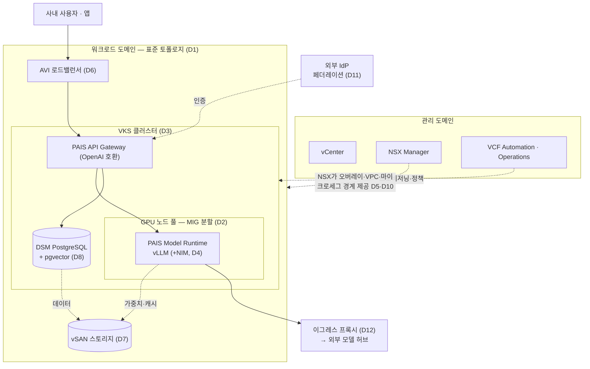

# 02 — 레퍼런스 설계 블루프린트

[← 목차로](../README.md)

블루프린트는 **여러 설계 결정을 미리 묶어 놓은 출발점**입니다. 12개 설계 결정([06](06-decision-forks.md))을 매번 새로 고르는 대신, 가장 가까운 블루프린트를 고르고 결정 요인에 맞춰 몇 개만 조정하면 됩니다. 단일 조직 규모의 소·중·대 세 가지와, 다수 테넌트를 폭으로 확장하는 전사 확장까지 네 가지를 제시합니다.

> 본 문서의 구성값은 작성 시점(2026-06) VCF 9.1 / PAIF 9.1 / PAIS 2.1 기준 **예시**이며, 실제 규모·구성은 [01 결정 요인](01-design-process.md)과 ⑥ 사이징으로 검증하시기 바랍니다.

---

## 2.1 블루프린트 사용법

1. [01](01-design-process.md)에서 결정 요인을 채웁니다.
2. 아래 소/중/대 중 가장 가까운 것을 고릅니다.
3. 결정 요인과 어긋나는 결정만 [06 카탈로그](06-decision-forks.md)로 바꾸고 설계 결정 기록(06.3)에 남깁니다.

각 블루프린트는 12개 결정(D1~D12)에 대한 기본 경로를 표로 제시합니다.

## 2.2 소(Entry / PoC)

빠르게 시작해 검증하는 최소 구성. 단일 팀, 비핵심 워크로드.

| 결정 | 기본 경로 |
|------|----------|
| D1 토폴로지 | 표준(standard) |
| D2 GPU 공유 | 타임슬라이싱(또는 단일 GPU) |
| D3 서빙 배치 | DLVM 또는 단일 VKS |
| D4 서빙 방식 | PAIS Model Runtime |
| D5 네트워킹 | 물리 VLAN 또는 단순 오버레이 |
| D6 LB | 내장 L4(Foundation·NSX) |
| D7 스토리지 | vSAN |
| D8 VectorDB | DSM pgvector |
| D9 가용성 | 단일 사이트 + 백업 |
| D10 테넌시 | soft(네임스페이스) |
| D11 Identity | 내장 |
| D12 에어갭 | 온라인 또는 프록시 |

**적합** — PoC·파일럿, 예산·호스트 제약. **주의** — 토폴로지는 규모와 무관하게 표준을 기본으로 합니다(통합은 비권고 → [3.1](03-compute-gpu-topology.md)). 작게 시작하되 관리·워크로드를 한 클러스터로 합치지 말고, 성장 시 GPU 도메인·노드를 추가하십시오.

## 2.3 중(Standard / Production)

표준 프로덕션. 다수 모델·다수 팀, 일반 기업 보안 기준.

| 결정 | 기본 경로 |
|------|----------|
| D1 토폴로지 | 표준(standard) |
| D2 GPU 공유 | MIG |
| D3 서빙 배치 | VKS |
| D4 서빙 방식 | PAIS Model Runtime (+ 필요 시 NIM) |
| D5 네트워킹 | NSX 오버레이 + VPC |
| D6 LB | AVI |
| D7 스토리지 | vSAN |
| D8 VectorDB | DSM pgvector |
| D9 가용성 | 단일 사이트(+ 옵션 stretched) |
| D10 테넌시 | soft + VPC 마이크로세그 |
| D11 Identity | 외부 IdP 페더레이션 |
| D12 에어갭 | 프록시 경유 |

**적합** — 대부분의 엔터프라이즈 프로덕션. 성능·격리·운영의 균형.

이 중(Standard) 구성을 논리 토폴로지로 보면 다음과 같습니다. 관리 도메인과 워크로드 도메인을 분리한 표준 토폴로지(D1) 위에, MIG로 나눈 GPU 노드 풀(D2)에서 PAIS Model Runtime이 모델을 서빙하고, DSM pgvector(D8)가 검색 데이터를 받칩니다. 외부 IdP(D11)가 인증을, AVI(D6)가 부하 분산을, NSX 오버레이·VPC(D5·D10)가 네트워크 경계를 맡습니다. (GitHub에서 자동 렌더링됩니다.)



소·대·전사 블루프린트는 이 그림을 기준으로, 각 절(§2.2·2.4·2.5) 표의 결정(D1~D12) 차이만큼 GPU 도메인·격리·가용성·테넌트 경계가 가감된 형태입니다.

## 2.4 대(Scale / Regulated)

대규모·규제. 강한 격리, 무중단, 데이터 주권.

| 결정 | 기본 경로 |
|------|----------|
| D1 토폴로지 | 표준 + 전용 GPU 워크로드 도메인 |
| D2 GPU 공유 | MIG + 대형 학습용 패스스루 혼합 |
| D3 서빙 배치 | VKS(멀티 클러스터) |
| D4 서빙 방식 | NIM + 자가 vLLM 혼합 |
| D5 네트워킹 | NSX 오버레이/VPC + 마이크로세그 |
| D6 LB | AVI + WAF |
| D7 스토리지 | vSAN ESA 또는 외장(요건별) |
| D8 VectorDB | DSM pgvector(+ 초대규모 시 외부 옵션) |
| D9 가용성 | 멀티사이트 DR(+ stretched) |
| D10 테넌시 | hard(테넌트별 클러스터/도메인) |
| D11 Identity | 외부 IdP 페더레이션 |
| D12 에어갭 | 완전 에어갭(미러 + Artifact Mirroring Tool) |

**적합** — 방산·금융·국가급 규제, 대규모 멀티테넌시.

## 2.5 전사 확장(멀티테넌트)

여러 사업부·테넌트가 한 전사 플랫폼을 공유하는 규모입니다. 앞의 소·중·대가 단일 조직이 자라는 단계라면, 이 블루프린트는 다수 테넌트를 같은 인프라 위에 올리되 보안·자원 경계를 테넌트별로 강제하는 설계입니다. 대(2.4)의 강한 격리를 출발점으로 삼고, 테넌트 온보딩·쿼터·GPU 분할 배분·관측을 전사 운영 수준으로 끌어올립니다.

| 결정 | 기본 경로 |
|------|----------|
| D1 토폴로지 | 표준 + 테넌트/공용 GPU 워크로드 도메인 분리 |
| D2 GPU 공유 | MIG(테넌트 간 하드웨어 격리) + 그룹 내 시분할 옵션 |
| D3 서빙 배치 | VKS(테넌트별 클러스터/네임스페이스) |
| D4 서빙 방식 | PAIS Model Runtime + NIM(테넌트 선택) |
| D5 네트워킹 | NSX Project·VPC(테넌트별 네트워크·보안 정책) |
| D6 LB | AVI(테넌트별 가상 서비스) |
| D7 스토리지 | vSAN(쿼터 경유 테넌트 배분) |
| D8 VectorDB | DSM pgvector(테넌트별 인스턴스/스키마) |
| D9 가용성 | 멀티사이트 DR + 테넌트별 SLA 차등 |
| D10 테넌시 | hard(Project + vSphere Namespace + NSX 경계) |
| D11 Identity | 외부 IdP 페더레이션(테넌트별 조직·역할) |
| D12 에어갭 | 테넌트 요건별(완전 에어갭·프록시 혼재) |

**격리 모델** — 전사 멀티테넌시는 단일 계층이 아니라 겹겹의 경계로 구성됩니다. 작성 시점(2026-06) VCF 9.1 기준으로, VCF Automation의 Project가 주 테넌시 경계(primary tenancy boundary)이며 Region을 통해 하부 Supervisor 클러스터에 매핑됩니다. Project 프로비저닝 시 Supervisor 클러스터에 vSphere Namespace가 생성되어 거버넌스 정책을 실제 워크로드 자원(쿼터)으로 강제하는 경계로 동작합니다. 격리는 두 수준으로 갈립니다.

- **하드 격리** — 별도 Project + 개별 리소스 쿼터 + NSX Project·VPC 기반 네임스페이스별 네트워크 격리. 전사 규모의 기본값.
- **소프트 격리** — VKS 클러스터 내부의 표준 쿠버네티스 네임스페이스(Pod·Service·Deployment 분리). 같은 테넌트 안의 하위 분리에 사용.

네트워크 경계는 NSX Project·VPC가, 자원·거버넌스 경계는 vSphere Namespace가 함께 작동합니다. 격리 강도를 어디까지 강제할지(soft 대 hard)는 ⑤ 테넌시·보안 설계의 [5.1 멀티테넌시 격리 결정](05-tenancy-security.md#51-결정-멀티테넌시-격리--soft네임스페이스-vs-hard클러스터도메인-분리)으로 위임합니다. (참고: VKS 3.6의 선언형 멀티 NIC는 NetworkPolicy(L4)로 닿지 않는 노드 NIC 수준 분리를 보완하나, 세부 적용은 적용 전 공식 문서 재확인을 권고합니다.)

**테넌트 온보딩** — Cloud Admin이 VCF Automation에서 Project를 생성하면, 개발자는 SSO 인증 후 할당된 프로젝트만 조회하고, 인프라가 대응 vSphere Namespace를 쿼터를 적용해 자동 프로비저닝합니다. 모델 자산은 Harbor(OCI) 기반 Model Gallery에 두고 프로젝트 수준 접근 통제로 학습·튜닝 데이터 접근을 제한합니다(Model Gallery는 Harbor 기반 모델 레지스트리로, 9.0에서 Model Store로도 표기된 동일 컴포넌트입니다).

**쿼터** — VI 관리자가 네임스페이스가 소비할 CPU(GHz)·RAM(GB)·스토리지(TB, VM Storage Policy 경유)를 명시적으로 정의합니다(예: 한 테넌트 네임스페이스를 512GB RAM·2TB vSAN으로 제한). 다만 작성 시점(2026-06) VCF 9.1 멀티테넌시 모드에서 vSphere Pod의 임시(ephemeral) 스토리지가 네임스페이스 쿼터에 집계되지 않는 알려진 제약이 있어, 테넌트 스토리지 한도 강제와 차지백 추적이 제한됩니다(적용 전 릴리스 노트 재확인 권고).

**GPU 분할 배분** — 멀티테넌트 GPU 공유는 격리 보장 수준으로 갈립니다. 설계 결정은 ⑥ [D2 GPU 공유](06-decision-forks.md#61-결정-색인-12건)로 위임합니다.

- **MIG(Multi-Instance GPU)** — 물리 GPU를 프레임 버퍼·SM·캐시·메모리 컨트롤러 수준으로 하드웨어 격리해 엄격한 QoS(한 워크로드가 다른 워크로드에 영향 없음)를 제공합니다. 테넌트 간 기본값.
- **타임슬라이싱** — 라운드로빈 스케줄러로 단일 GPU를 공유합니다. 동적 활용은 좋으나 co-tenant 활동에 성능이 좌우되어 QoS 보장이 없습니다. 같은 테넌트 내 dev 가변부하에 한정 권고.
- **하이브리드(시분할 MIG 기반 vGPU)** — MIG의 공간 분할과 타임슬라이싱의 시간 분할을 한 MIG 인스턴스 안에서 결합해, 그룹 간 하드웨어 격리 + 그룹 내 공유를 동시에 노립니다(예: 한 팀이 받은 MIG 슬라이스를 그 팀 개발자들이 시분할). 단 이 모드의 정식 명칭·지원 범위는 공식 문서 기준까지만 확인되었으므로, 적용 전 1차 공식 문서로 한 번 더 확인하시기 바랍니다.

제약 — 동일 물리 GPU에 MIG와 타임슬라이스 프로필은 공존 불가, VM당 MIG 기반 vGPU 프로필은 1개입니다. 클러스터 전역 vGPU 소비·잔여 용량은 DirectPath Profile(DPP) 소비·잔여를 vSphere Client의 vGPU Profile Utilization 뷰로 조망합니다.

**관측·showback** — AI 관측·거버넌스가 time-to-first-token, 토큰 처리량, 다종 가속기 GPU 활용 지표를 제공하고, Private AI Model·GPU Metrics가 활용률·메모리 압박·모델 수준 가시성을 전체 인프라와 같은 콘솔에서 노출합니다. 다만 별도 showback·차지백 과금 메커니즘은 명시 확인되지 않았고(앞의 임시 스토리지 미집계 제약이 차지백을 제약), 과금 설계는 이들 메트릭 기반 추정으로 두되 적용 전 공식 문서 확인이 필요합니다.

**멀티테넌시·GPU 공유 설계 결정** — 격리 강도(D10)는 [⑤ 5.1](05-tenancy-security.md#51-결정-멀티테넌시-격리--soft네임스페이스-vs-hard클러스터도메인-분리), GPU 공유 방식(D2)은 [⑥ 6.1 결정 색인](06-decision-forks.md#61-결정-색인-12건)에서 결정 요인에 맞춰 고르시기 바랍니다.

**적합** — 다수 사업부·자회사를 한 플랫폼에 수용하는 전사 AI 인프라, 내부 클라우드/플랫폼 팀이 테넌트에 GPU를 서비스로 제공하는 운영 모델.

## 2.6 블루프린트 비교·성장 경로

| 차원 | 소 | 중 | 대 | 전사 확장 |
|------|----|----|----|----------|
| 격리 | 논리 | 표준 | 강함 | 강함(테넌트별 Project·Namespace 경계) |
| 가용성 | 백업 | 단일·옵션 stretched | 멀티사이트 DR | 멀티사이트 DR + 테넌트 SLA 차등 |
| 운영 부담 | 낮음 | 중 | 높음 | 높음(온보딩·쿼터·showback 운영) |
| 적합 | PoC | 프로덕션 | 규제·대규모 | 다수 사업부·테넌트 전사 공유 |

성장·확장 경로를 정리하면 다음과 같습니다. 소→중→대는 같은 표준 토폴로지 위에서 자라는 깊이의 축이고, 대→전사는 폭의 축입니다.

```
소 (PoC)
 └▶ 중 (Standard)         : GPU 도메인·노드 추가, 결정 상향(GPU 공유·LB·가용성·격리)
     └▶ 대 (Scale/Regulated) : 격리 강화 · 멀티사이트 DR · VKS 멀티클러스터
         └▶ 전사 확장         : 대의 강격리를 테넌트 수만큼 복제
                              + Project 온보딩 · 테넌트별 쿼터 · GPU 분할 배분 · showback
```

**성장 경로** — 네 블루프린트 모두 **표준 토폴로지**를 기본으로 합니다(통합은 비권고 → [3.1](03-compute-gpu-topology.md)). 소 → 중 → 대 성장은 토폴로지 재배포 없이 GPU 도메인·노드 추가와 설계 결정 상향(GPU 공유·LB·가용성·격리)으로 이뤄집니다. 대 → 전사 확장은 단계 상향과 성격이 다릅니다 — 대의 강한 격리를 테넌트 수만큼 복제하고, 그 위에 Project 기반 온보딩·테넌트별 쿼터·GPU 분할 배분·showback 관측을 전사 운영 계층으로 얹습니다.

---
[← 이전: 01 설계 프로세스와 요구사항 수집](01-design-process.md) · [목차](../README.md) · [다음: 03 설계 결정 — 컴퓨트·GPU·VKS 토폴로지 →](03-compute-gpu-topology.md)
