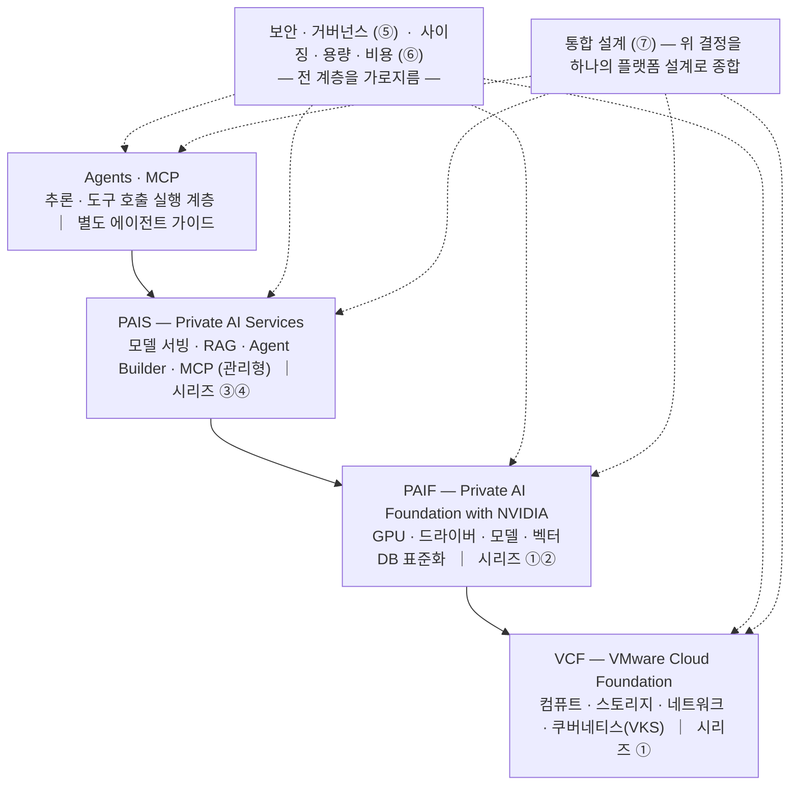

# VCF Private AI 가이드 시리즈

VMware Cloud Foundation(VCF) **9.1** 기반 **Private AI**를 다루는 공개 실무 가이드입니다(전 7편, 단일 저장소). 핵심 축인 **PAIF**(Private AI Foundation with NVIDIA)와 **PAIS**(Private AI Services)를 **인프라 → 데이터 → 서빙 → 통합(RAG)** 흐름으로 풀어냅니다. **보안·거버넌스**와 **사이징·용량·비용**은 이 모든 계층을 가로지르고, **통합 설계**는 이 결정들을 하나의 일관된 플랫폼 설계로 묶습니다. 그 플랫폼 위에 올리는 **에이전트 서비스**는 시리즈의 번호 챕터가 아니라 별도 최상위 가이드에서 다룹니다(아래 '다음 단계').

데이터가 사내를 벗어나지 않는 환경에서 LLM·RAG·에이전트 서비스를 처음부터 끝까지 **구축·운영·보호·산정**하려는 인프라팀·MLOps·앱 개발자를 위한 현장 레퍼런스를 지향합니다. 모든 수치·버전은 작성 시점(2026-06) Broadcom 공식 릴리스 노트를 기준선으로 하며, 적용 전 공식 문서 재확인을 권장합니다.

## 무엇을 얻나 — 비즈니스 관점

생성형 AI의 가치는 분명하지만, 사내 데이터를 외부 서비스에 보낼 수 없는 조직에는 **"데이터를 내보내지 않고 그 가치를 어떻게 얻느냐"** 가 관문입니다. 이 시리즈가 다루는 Private AI는 모델을 **사내 데이터센터 안에서** 돌립니다. 그 결과, 데이터가 경계를 벗어나지 않은 채 다음을 할 수 있습니다.

- **사내 지식의 즉시 활용** — 흩어진 매뉴얼·규격·이력을 자연어로 묻고 근거와 함께 답을 얻습니다.
- **반복 업무의 초안 자동화** — 리포트·분석 초안을 사람이 검토·확정하는 흐름으로 처리 시간을 줄입니다.
- **규제·기밀 환경 적합** — 데이터 사외 반출 없이, 접근통제·감사를 갖춘 상태로 운영합니다.

추상적 약속이 아니라 **무엇을·왜·어떤 지표로** 푸는지는 산업 유스케이스로 정리했습니다.

→ **[산업 유스케이스 — 결과·KPI로 보는 에이전트](https://github.com/JaeHoYun/vcf-private-ai-agents/blob/main/docs/08-use-cases.md)**

## 시작하기 전에 (Primer)

이 시리즈는 독자가 임베딩·벡터·토큰·RAG·에이전트, 그리고 쿠버네티스(VKS)를 **이미 안다고** 전제합니다. 그 출발선이 아직 낯설다면, 본편에 앞서 입문 자료로 기초 어휘를 먼저 잡으시길 권합니다.

→ **[VCF Private AI 입문 (Primer)](00-foundations/README.md)** — 인프라 엔지니어를 위한 AI 101, vSphere 관리자를 위한 K8S/VKS 101, GPU 인프라를 잡는 GPU 101과 그 위 소프트웨어를 잡는 생태계 SW 101, 통합 용어집. 시리즈 번호(①–⑦)에 속하지 않는 별도 입문 트랙입니다. 본편을 이미 편하게 읽고 있다면 건너뛰어도 됩니다.

## 이 시리즈의 관점 — Private AI를 떠받치는 기반

이 시리즈는 어떤 LLM을 고르고 어떻게 프롬프트를 짜는지를 다루지 않습니다. 그 모델들이 **사내에서, 데이터가 밖으로 나가지 않은 채** 돌아가게 하는 **기반**을 다룹니다.

Private AI의 본질적 질문은 "어떤 모델인가"가 아니라 **"그 모델을 사내 데이터센터 안에서 안전하고 효율적으로 돌릴 토대를 어떻게 만드는가"** 입니다. 그 토대는 다음 네 계층으로 이루어집니다.

- **VCF** — 프라이빗 클라우드 플랫폼. 컴퓨트·스토리지·네트워크와 쿠버네티스(VKS)를 묶는 바닥.
- **PAIF** — VCF 위에서 GPU·드라이버·모델·RAG를 표준화하는 AI 인프라 계층.
- **PAIS** — 모델 서빙·RAG·에이전트(Agent Builder)·MCP를 관리형으로 올리는 서비스 계층.
- **Agents · MCP** — 모델이 사내 데이터·도구와 표준 인터페이스로 연결되어 실제 일을 수행하는 실행 계층. 이 계층은 시리즈 본편이 아니라 별도 최상위 [에이전트 가이드](https://github.com/JaeHoYun/vcf-private-ai-agents)에서 다룹니다.

> 위에서 아래로 **실행(에이전트) → 서비스(PAIS) → AI 인프라(PAIF) → 플랫폼(VCF)** 의 4계층이며, 보안·비용(⑤⑥)이 전 계층을 가로지르고 통합 설계(⑦)가 이를 종합합니다.

그래서 이 시리즈의 모든 편 — 데이터(VectorDB)·서빙·RAG·보안·거버넌스·사이징·비용 — 은 결국 **"Private AI를 떠받치는 기반을 어떻게 구축·운영·보호·산정하는가"** 라는 하나의 질문으로 모입니다. ①–④는 그 토대를 쌓아 올리는 구축 흐름이고, ⑤·⑥은 그 토대 전체를 가로지르는 보안·비용 관점이며, ⑦은 이 모두를 하나로 종합하는 통합 설계 편입니다. 그 플랫폼 위에 에이전트 서비스를 구현·운영하는 일은 시리즈와 별개의 최상위 가이드에서 다룹니다(아래 '다음 단계').

---

## 가이드 목록

| 편 | 폴더 | 계층 | 다루는 영역 |
|----|------|------|-------------|
| ① | [01-infra](01-infra/README.md) | 인프라·운영 | PAIF/PAIS 구축·개발·운영 전반, GPU·아키텍처, What's New(9.1), 산업 시나리오 |
| ② | [02-vectordb](02-vectordb/README.md) | 데이터 | RAG용 엔터프라이즈 벡터 DB (DSM PostgreSQL + pgvector), 배포·운영 런북 |
| ③ | [03-serving-api](03-serving-api/README.md) | 서빙 | OpenAI 호환 모델 서빙 API, 추론·에이전트 엔드포인트, 인증·MCP·관측성 |
| ④ | [04-rag](04-rag/README.md) | 통합 | ②③을 하나로 꿰는 엔드투엔드 RAG 레퍼런스 아키텍처 |
| ⑤ | [05-security](05-security/README.md) | 보안·거버넌스 | 위협모델·격리·접근통제·공급망·데이터 거버넌스·감사 (전 계층 가로지름) |
| ⑥ | [06-sizing-cost](06-sizing-cost/README.md) | 사이징·용량·비용 | 워크로드·GPU·VKS 사이징, 용량 계획, TCO (전 계층 가로지름) |
| ⑦ | [07-design](07-design/README.md) | 통합 설계 | 12개 설계 결정, 레퍼런스 블루프린트(소·중·대), ADR 카탈로그 (전 계층 종합) |

> 위 ①–⑦이 Private AI **플랫폼**을 구축·운영·보호·설계하는 시리즈 본편이며, 그 플랫폼 **위에 올리는 에이전트 서비스**는 아래 '다음 단계'의 별도 최상위 가이드에서 다룹니다.

## 읽는 순서

- **처음 도입한다** → ① 전체 → ② → ③ → ④
- **인프라는 있고 RAG만 올린다** → ④ 를 중심으로 ②③ 참조
- **앱 개발자다** → ③ + ④ 의 앱 통합 문서
- **보안·규제 대응이 우선이다** → ⑤ 전반 (①–④ 각 편과 교차 참조)
- **규모·예산을 산정한다** → ⑥ 전반 (특히 GPU·VKS 클러스터 사이징과 TCO)
- **9.1로 올라간다** → ① 의 What's New(00)
- **설계를 종합하고 결정을 내린다** → ⑦ (12개 설계 결정·블루프린트, ①–⑥로 딥링크)
- **에이전트 서비스를 만든다** → 아래 '다음 단계'의 [에이전트 가이드](https://github.com/JaeHoYun/vcf-private-ai-agents) (Agent Builder·MCP·Model Runtime, ③④로 딥링크)

## 다음 단계 — 에이전트 서비스

이 시리즈는 Private AI **플랫폼**을 구축·운영·보호·설계하는 ①–⑦입니다. 그 플랫폼 **위에 에이전트 서비스를 올리는** 일은 시리즈의 번호 챕터가 아니라 별도의 최상위 가이드에서 다룹니다. 플랫폼(이 시리즈)과 그 위 실행 계층(에이전트)을 분리해, 프로필의 **AX(전략) → Private AI(인프라) → 에이전트(실행)** 3단계 구성과 맞춥니다.

- [PAIS 에이전트 서비스 가이드](https://github.com/JaeHoYun/vcf-private-ai-agents) — PAIS 2.1 Agent Builder·MCP·Model Runtime으로 추론·도구 호출 에이전트를 설계·구축·운영. 서빙(③)·RAG(④)로 딥링크.

## 관련 가이드

이 시리즈는 Private AI를 떠받치는 **인프라·구현**을 다룹니다. 그 위에서 "AI 전환(AX)을 조직 차원에서 어떻게 추진할 것인가"라는 **상위 전략·방법론**은 다음 독립 가이드에서 다룹니다.

- [기업용 AX(AI Transformation) 방법론 가이드](https://github.com/JaeHoYun/enterprise-ax-methodology) — DX 답습형 AX의 실패 진단, 증거 기반 점진적 전환이라는 대안, 그리고 검증된 유스케이스를 Private AI로 갖추는 구현 전략. Private AI 구현 경로로 본 시리즈를 참조합니다.

### 업계 맥락 — 추가 읽기

플랫폼 엔지니어링이 AI 시대에 어떻게 진화하는지에 대한 업계 논의도 이 시리즈가 다루는 계층과 맞닿습니다.

- [Platform Engineering 2.0: An Evolution for the AI Era](https://www.linkedin.com/pulse/time-platform-engineering-20-now-vmwarevcf-m3yfc/) — Broadcom·PlatformEngineering.org 공동 백서. 개발자 중심 플랫폼(1.0)이 AI 네이티브 플랫폼(GPU·모델 서빙·MCP)·다중 페르소나·내장 FinOps·보안 기층화·컴포저블 아키텍처의 다섯 축으로 확장된다는 프레임워크로, 본 시리즈 ①~⑦과 에이전트 가이드의 기술 토픽과 거의 1:1로 대응합니다.

## 기반 버전 (요약)

| 구분 | 버전 |
|------|------|
| VMware Cloud Foundation | 9.1 (GA 2026-05) |
| Private AI Foundation with NVIDIA (PAIF) | 9.1 |
| Private AI Services (PAIS) | 2.1 |
| PostgreSQL / pgvector (DSM 9.1) | 16.8 / 0.8.0 (PAIS 검증 조합) |

> 엔진·컴포넌트 상세 버전 단일 기준 문서는 [① README의 기반 버전표](01-infra/README.md#기반-버전-source-of-truth)를 따릅니다.

## 주요 주제

`VCF` · `PAIF` · `PAIS` · `VKS` · `vSAN` · `NSX` · `DLVM` · `vLLM` · `RAG` · `VectorDB` · `pgvector` · `Model Serving` · `MCP` · `Agent Builder` · `Security` · `Governance` · `Sizing` · `TCO` · `Design` · `Blueprint` · `ADR`

## 라이선스

이 시리즈의 모든 문서는 [CC BY 4.0](https://creativecommons.org/licenses/by/4.0/)으로 제공됩니다. 자유롭게 활용하시되 출처를 표기해 주세요.

## 면책

**비공식 문서** — Broadcom·NVIDIA 등 벤더의 공식 입장을 대변하지 않습니다. 프로덕션 적용 전 반드시 공식 문서를 확인하시기 바랍니다. 본문의 성능·비용 수치는 벤더 발표 기준이며, 실제 결과는 워크로드·환경마다 달라 별도 검증이 필요합니다. 언급된 제품명·상표는 각 소유자의 자산입니다.
